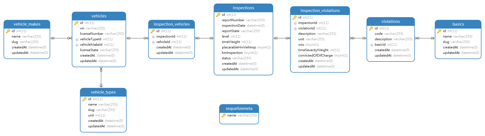

# Fullstack assignment

Express, Sequelize, NextJs, ReactJs, Tailwindcss, TypeScript

## Global Requisites
* node (^14.*)
* yarn (^1.4)

## Install, Configure & Run
Below mentioned are the steps to install, configure & run in your platform/distributions.

### Install
```bash
# Run command to clone the repo.
git clone https://github.com/anhht83/fs_assignment.git

# Goto the cloned project folder, run command
cd <root dir of project>

# Run command to install packages dependencies.
yarn steup
```

### Configure 
#### Configure database connection in your backend dir
- Create a new MySql database
- Edit your `backend/.env` files to config database connection
```bash
DB_CLIENT=mysql
DB_HOST=localhost
DB_USER=root
DB_PASSWORD=password 
DB_NAME=database name
DB_PORT=3306 
```
- Migrate database
```bash
# Run command to migrate database
yarn migrate
```
**NOTE**: Sequelize support multiple RMDBs. You'll also have to manually install the driver for your database of choice:
```bash
# One of the following:
$ yarn add --save pg pg-hstore # Postgres
$ yarn add --save mysql2
$ yarn add --save mariadb
$ yarn add --save sqlite3
$ yarn add --save tedious # Microsoft SQL Server
$ yarn add --save oracledb # Oracle Database
```

### Run
```bash
# Run development from your root dir of the apps to run both frontend and backend app
yarn dev
```
After run successful, access the link below to check your installation http://localhost:3000, and API document http://localhost:3001/docs


### Build code and deployment
```bash
# Build code to "dist" folder
yarn build
```

# Frontend Development
Pls check `frontend/README.md` for detail

# Backend Development
Pls check `backend/README.md` for detail

# Database Models


# Connect
**Anh Tuan Hoang** <anhht83@gmail.com>  https://github.com/anhht83
